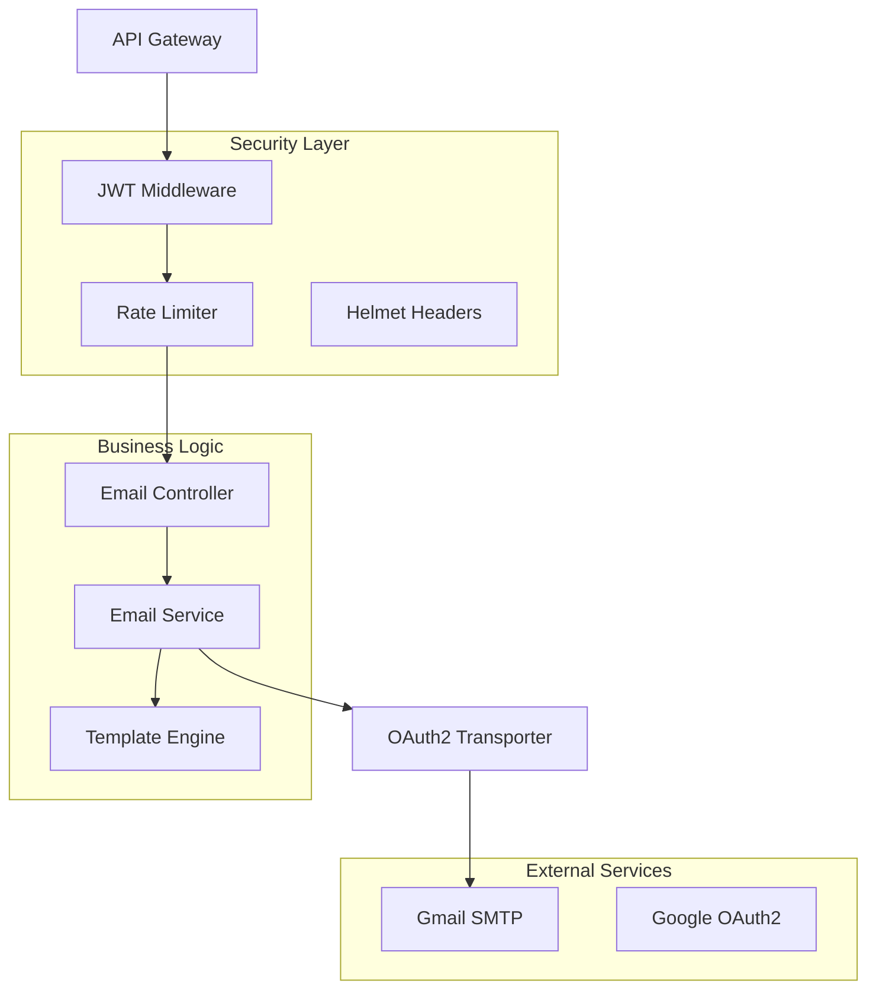

# 🚀 ElberAI Notification Service

[](https://www.typescriptlang.org/)
[](https://nodejs.org/)
[](https://expressjs.com/)
[](https://www.docker.com/)
[](https://oauth.net/2/)

> **Notification microservice** with advanced security, OAuth2 authentication, and scalable email delivery system built for high-traffic applications.

## 📋 Table of Contents
- [🎯 Overview](#-overview)
- [✨ Key Features](#-key-features)  
- [🛠 Tech Stack](#-tech-stack)
- [⚡ Quick Start](#-quick-start)
- [📚 API Documentation](#-api-documentation)
- [🏗 Architecture](#-architecture)
- [🔒 Security](#-security)
- [🐳 Docker Deployment](#-docker-deployment)
- [💻 Development Setup](#-development-setup)

## 🎯 Overview

A **production-ready microservice** designed to handle enterprise-level email notifications with **OAuth2 integration**, **JWT authentication**, and **rate limiting**. Built with **Clean Architecture** principles, this service manages multiple notification workflows including user access requests, account verification, and password recovery with **HTML templating** and **multi-stage Docker builds**.

## ✨ Key Features

- 🔐 **OAuth2 + JWT Security** - Enterprise-grade authentication with Google OAuth2 and internal JWT validation
- 📧 **Multi-Template Email System** - Dynamic HTML templates for different notification types 
- 🚦 **Rate Limiting & DDoS Protection** - 100 requests/15min per IP with Helmet security headers
- 🏗 **Clean Architecture** - Modular design with controllers, services, middleware layers
- 🐳 **Multi-Stage Docker Build** - Optimized production images with minimal attack surface
- 📊 **Type-Safe Development** - Strict TypeScript with comprehensive type definitions
- ⚡ **High Performance** - Async email delivery with connection pooling

## 🛠 Tech Stack

### **Core Technologies**
| Technology | Purpose | Version |
|------------|---------|---------|
| [](https://www.typescriptlang.org/) | Type-safe development | ^5.9.2 |
| [](https://nodejs.org/) | Runtime environment | LTS 20+ |
| [](https://expressjs.com/) | Web framework | ^5.2.1 |

### **Security & Authentication**
| Technology | Purpose |
|------------|---------|
| [](https://jwt.io/) | Token authentication |
| [](https://helmetjs.github.io/) | Security headers |
| [](https://oauth.net/2/) | Google SMTP integration |

### **Email & Communication**
| Technology | Purpose |
|------------|---------|
| [](https://nodemailer.com/) | Email delivery |
| HTML Templates | Dynamic content generation |

### **DevOps & Deployment**
| Technology | Purpose |
|------------|---------|
| [](https://www.docker.com/) | Containerization |
| Multi-stage builds | Production optimization |

## ⚡ Quick Start

```bash
# 🚀 Clone and setup
git clone <repository>
cd backEnd/notification-services

# 📦 Install dependencies
npm install

# ⚙️ Configure environment
cp .env.template .env
# Edit .env with your credentials

# 🏃‍♂️ Development mode
npm run dev

# 🏗 Production build
npm run build && npm start
```

**🌐 Service available at:** `http://localhost:4043`

## 📚 API Documentation

### **Authentication Required** 🔒
All endpoints require JWT token in Authorization header: `Bearer <token>`

### **Core Endpoints**

<details>
<summary><strong>📋 Health Check</strong></summary>

```http
GET /health
```
**Response:**
```json
{
  "endPoint": "/notification"
}
```
</details>

<details>
<summary><strong>📧 Access Request</strong></summary>

```http
POST /email/requestAccess
Content-Type: application/json
Authorization: Bearer <jwt_token>

{
  "userEmail": "user@example.com",
  "approveURL": "https://app.com/approve/123",
  "rejectURL": "https://app.com/reject/123"
}
```
**Workflow:** Sends confirmation to user + admin notification with approve/reject links
</details>

<details>
<summary><strong>✅ Access Response</strong></summary>

```http
POST /email/accessResponse
Content-Type: application/json

{
  "email": "user@example.com",
  "isApproved": true,
  "accessCode": 123456
}
```
</details>

<details>
<summary><strong>🔐 Account Verification</strong></summary>

```http
POST /email/verifyAccount
Content-Type: application/json

{
  "email": "user@example.com",
  "name": "Juan Pérez",
  "link": "https://app.com/verify/abc123"
}
```
</details>

<details>
<summary><strong>🔄 Password Reset</strong></summary>

```http
POST /email/resetPassword
Content-Type: application/json

{
  "email": "user@example.com",
  "recoverLink": "https://app.com/reset/xyz789"
}
```
</details>

## 🏗 Architecture



### **🔧 Design Patterns Implemented**
- **Repository Pattern** - Service layer abstraction
- **Factory Pattern** - Email template generation  
- **Strategy Pattern** - Multiple notification types
- **Middleware Chain** - Request processing pipeline
- **Dependency Injection** - Configuration management

## 🔒 Security

### **🛡 Security Measures Implemented**

| Feature | Implementation | Purpose |
|---------|----------------|---------|
| **JWT Validation** | `jsonwebtoken` | Service-to-service authentication |
| **Rate Limiting** | `express-rate-limit` | 100 req/15min per IP - DDoS protection |
| **OWASP Headers** | `helmet` | XSS, CSRF, clickjacking protection |
| **OAuth2 Integration** | Google Service Account | Secure SMTP authentication |
| **Environment Isolation** | `.env` files | Credential security |
| **Input Validation** | Express middleware | Prevent injection attacks |

### **🔐 Authentication Flow**
```typescript
// JWT middleware validates internal service calls
export const validateToken = (req: Request, res: Response, next: NextFunction) => {
    const token = req.headers.authorization?.split(' ')[1]
    jwt.verify(token, auth.token as string)
    // Proceeds only if valid JWT
}
```

## 🐳 Docker Deployment

### **Multi-Stage Production Build**
```dockerfile
# Optimized for production with minimal attack surface
FROM node:20-alpine AS builder
# Build stage with dev dependencies

FROM node:20-alpine
# Runtime stage with only production deps
EXPOSE 4043
CMD ["node", "dist/bin/www.js"]
```

### **🚀 Deploy Commands**
```bash
# 🏗 Build production image
docker build -t notification-service .

# 🏃‍♂️ Run container
docker run -p 4043:4043 \
  -e GOOGLE_APPLICATION_CREDENTIALS=/app/creds/google.json \
  -e INTERNAL_TOKEN=your_jwt_secret \
  notification-service

# 🌐 Docker Compose (recommended)
docker-compose up -d
```

## 💻 Development Setup

### **🔧 Prerequisites**
- Node.js 20+ 
- npm/yarn
- Google OAuth2 credentials
- Docker (optional)

### **📝 Environment Configuration**
```bash
# Required environment variables
GOOGLE_APPLICATION_CREDENTIALS=path/to/google/creds.json
NOTIFICATION_PORT=4043
INTERNAL_TOKEN=your_jwt_secret_key
```

### **🛠 Development Workflow**
```bash
# 📦 Install dependencies
npm install

# 🔥 Hot reload development
npm run dev

# 🧪 Type checking
npx tsc --noEmit

# 🏗 Production build
npm run build

# 🚀 Start production server
npm start
```

### **📊 Project Structure**
```
src/
├── app.ts              # Express app configuration
├── bin/www.ts          # Server bootstrap
├── config/             # Environment configuration
├── controllers/        # Request handlers
├── middlewares/        # Custom middleware
├── routes/             # API routes definition
├── services/           # Business logic layer
├── templates/          # HTML email templates
└── types/              # TypeScript definitions
```


---

<div align="center">

**Built with ❤️ by [Martin Nava](https://github.com/mnava1418)**

*Showcasing enterprise-level Node.js architecture, security best practices, and scalable microservice design*

</div>
